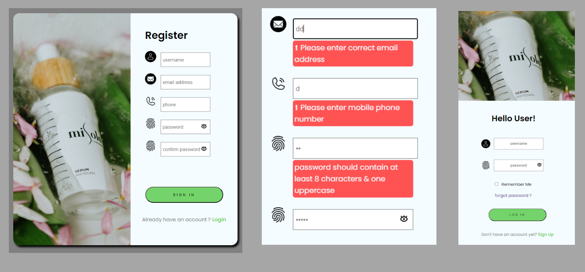

 

# Interactive login & signin form

 Project is an interactive form that allows users to log in or sign up if they don't have an account yet.

 - To handle state management within the application, I utilized the <b>useContext</b> hook.

 - Designed to be fully <b>responsive</b> and optimized for mobile devices.

 - The project includes <b>data validation</b> to guide users in correctly filling out the form.
 
 - I implemented The <b>Framer Motion</b> library which allows the screen to rotate when transitioning from the login to the sign-up page. 

I'm happy to present this interactive project and hope it proves to be both useful and enjoyable for users. 

# Getting Started with Create React App

This project was bootstrapped with [Create React App](https://github.com/facebook/create-react-app).

## Available Scripts

In the project directory, you can run:

### `npm start`

Runs the app in the development mode.\
Open [http://localhost:3000](http://localhost:3000) to view it in your browser.

The page will reload when you make changes.\
You may also see any lint errors in the console.

### `npm run build`

Builds the app for production to the `build` folder.\
It correctly bundles React in production mode and optimizes the build for the best performance.

The build is minified and the filenames include the hashes.\
Your app is ready to be deployed!

See the section about [deployment](https://facebook.github.io/create-react-app/docs/deployment) for more information.

## Learn More

You can learn more in the [Create React App documentation](https://facebook.github.io/create-react-app/docs/getting-started).

To learn React, check out the [React documentation](https://reactjs.org/).

### Code Splitting

This section has moved here: [https://facebook.github.io/create-react-app/docs/code-splitting](https://facebook.github.io/create-react-app/docs/code-splitting)

